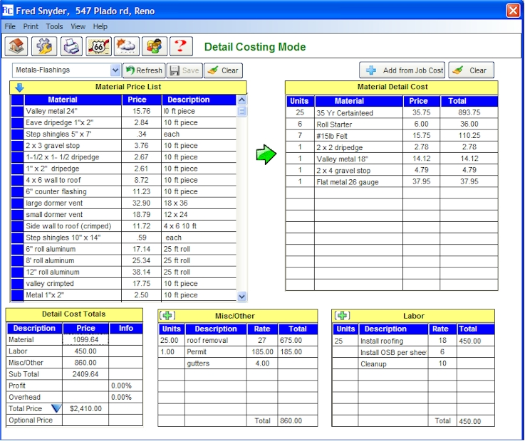



## Fade picture to another

### Description

Fade one picture into another. Picture are stored in a resource file as jpg's as cuctom
 
### More Info
 
form hot keys will also change the images eg:

F2, F3, F7,F8,F9,F11,F12

             |
---                |---
**Submitted On**   |2010-01-15 09:33:52
**By**             |[Rob Moore](https://github.com/Planet-Source-Code/PSCIndex/blob/master/ByAuthor/rob-moore.md)
**Level**          |Intermediate
**User Rating**    |5.0 (15 globes from 3 users)
**Compatibility**  |VB 6\.0
**Category**       |[Graphics](https://github.com/Planet-Source-Code/PSCIndex/blob/master/ByCategory/graphics__1-46.md)
**World**          |[Visual Basic](https://github.com/Planet-Source-Code/PSCIndex/blob/master/ByWorld/visual-basic.md)
**Archive File**   |[Fade\_pictu2172881152010\.zip](https://github.com/Planet-Source-Code/rob-moore-fade-picture-to-another__1-72841/archive/master.zip)

